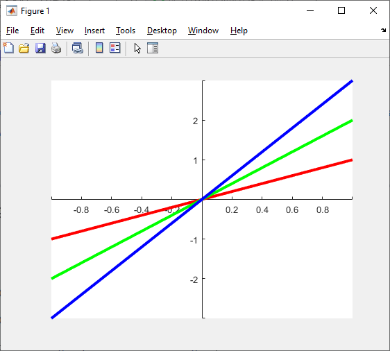

# 그래픽 객체의 순서 바꾸기

### Axes 상 그래픽 객체의 순서를 바꿀 수 있습니다.
* 아래의 결과는 모두 R2022a 기준입니다.
* 참고한 곳들
  * https://stackoverflow.com/questions/7674700/how-to-change-the-order-of-lines-in-a-matlab-figure
  * https://www.mathworks.com/help/matlab/ref/uistack.html
  
* 작성자: [게으른](https://github.com/keizikang)

---

### 1. 테스트용 그래프 그리기

* 적당히 겹쳐있는 Line, FunctionLine, ConstantLine을 그려봅니다.

```matlab
figure, hold on,
plot(linspace(-1, 1), linspace(-1, 1), 'r', linewidth=3)
fplot(@(x) exp(-x)-1, [-1, 1], 'g', linewidth=3)
yline(.5, 'b', linewidth=3, Alpha=1)

set(gca, XAxisLocation='origin', YAxisLocation='origin')
```



* Axes에는 그래프를 그린 순서대로 올라갑니다.
  * 가장 먼저 그린 빨간 Line이 가장 아래에 있습니다.
  * 그 다음 그린 녹색 FunctionLine이 그 위에 올라갑니다.
  * 마지막에 그린 파란 ConstantLine이 가장 위에 올라갑니다.
* gca의 Children 목록에도 이 순서대로 들어갑니다.
  * 가장 먼저 그린 빨간 Line이 목록의 가장 아래에 있습니다.
  * 그 다음 그린 녹색 FunctionLine이 밑에서 두 번째에 있습니다.
  * 마지막에 그린 파란 ConstantLine이 가장 위에 있습니다.

```matlab
>> allchild(gca)
ans = 
  3×1 graphics array:

  ConstantLine
  FunctionLine
  Line
```

* 그래픽 객체가 추가될 때마다 기존 목록 아래에 붙는 방식이 아닌, 하나씩 밀리면서 목록 상단에 추가되는 방식입니다.
* Children 목록 상단에 있는 객체가 Axes 상에서도 가장 위에 올라가는 것으로 이해할 수 있습니다.

---

### 2. uistack 활용

* uistack()을 이용하면 이 라인들의 순서를 바꿀 수 있습니다.
* uistack(H)는 H를 한 칸 위로 올립니다.


